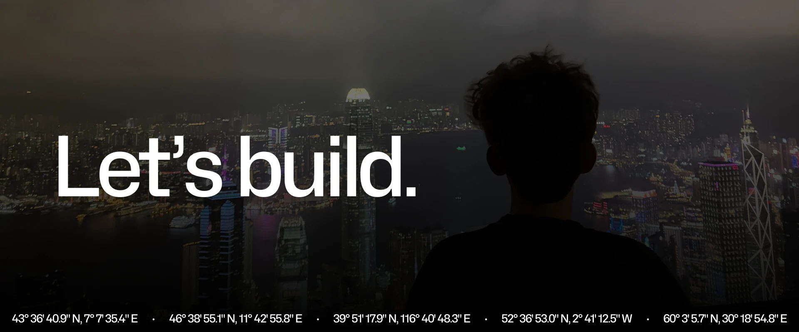

🏄 10x Prompt Engineer, Student, Next.js Veteran, Cloudflare addict and Bun.js glazer

Caught your attention? Check out the site 👉 <a href="https://nitlix.com" 
style="color: lightgrey; text-decoration: underline;" target="_blank">nitlix.com</a>

    
    
    

